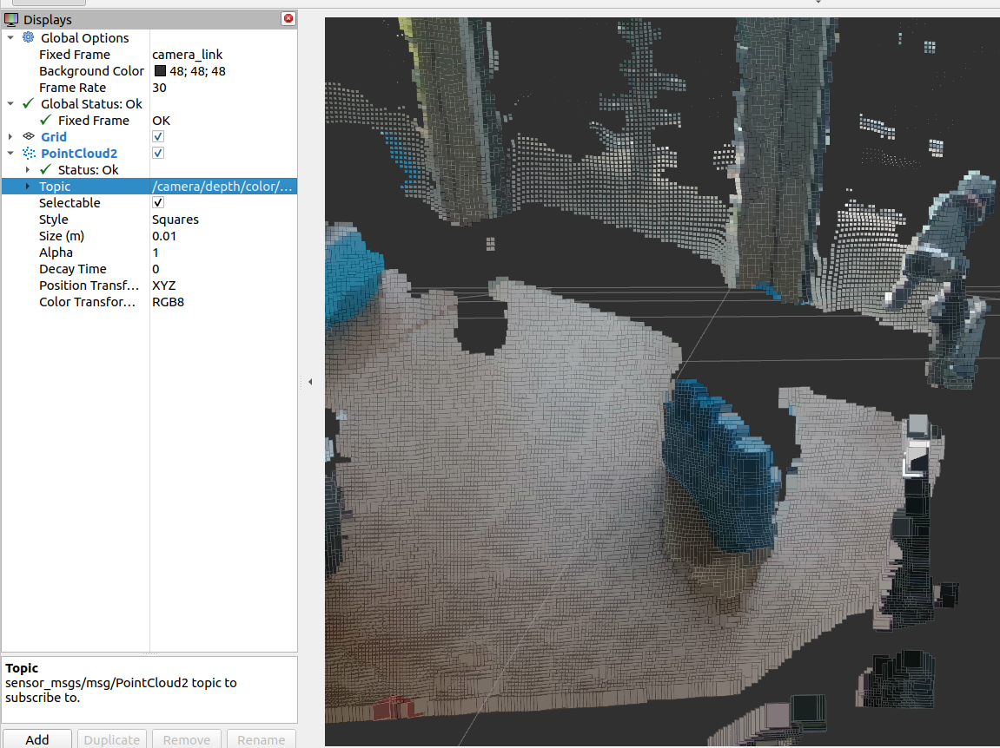
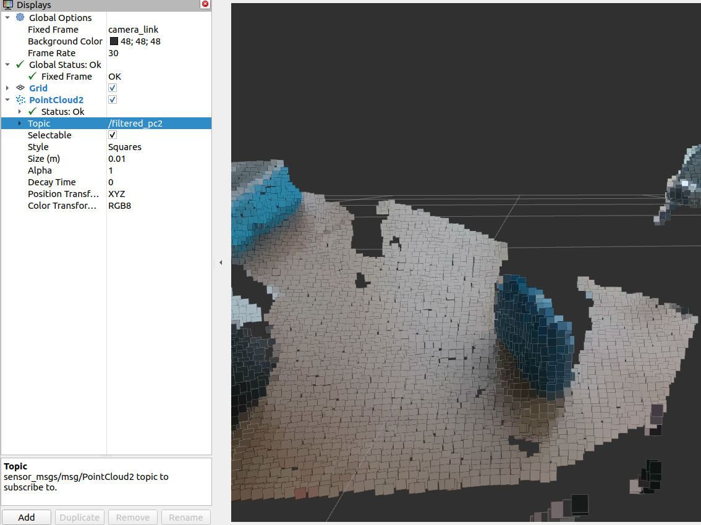

# PointCloud Filter ROS2
A ROS2 package written in C++ for filtering a PointCloud2 msg received on a topic that publishes the filtered pointcloud in another topic.  
(ROS2 porting of http://wiki.ros.org/voxel_grid + segmentation)

### Parameters
You can adjust your settings inside the launch file. These are the parameters:  
``"input_topic_name",
"output_topic_name",
"voxel_grid_size",
"segment_distance_min",
"segment_distance_max"``   
 
### Launch the node  
``ros2 launch pc2_filter filter.launch.py``  

On the left the original image and on the right the filtered one.
<table>
  <tr>
    <td>
    
    </td>
    <td>
    
      </td>
  </td>
  <tr>
  </tr>
</table>

